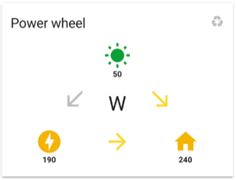
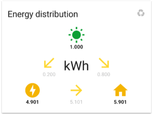

power-wheel-card
====

[](https://github.com/custom-components/hacs)

An intuitive way to represent the power and energy that your home is consuming or producing.
> This component is a custom card for the Lovelace UI of Home Assistant. The component is discussed [here](https://community.home-assistant.io/t/lovelace-power-wheel-card/82374) on the Home Assistant forum. There's also a [wiki](https://github.com/gurbyz/power-wheel-card/wiki/Troubleshooting-guide) on GitHub.

## Table of Contents
* [Features](#Features)
* [Requirements for the power view](#Requirements-for-the-power-view)
* [Requirements for the energy view](#Requirements-for-the-energy-view)
* [Requirements for the money view](#Requirements-for-the-money-view)
* [Installation instructions](#Installation-instructions)
* [Configuration instructions](#Configuration-instructions)
    * [Icons](#Icons)
    * [View toggling](#View-toggling)
    * [Advanced configuration example](#Advanced-configuration-example)
* [BETA battery feature in power view](#BETA-battery-feature-in-power-view)
    * [Configuration instructions battery feature](#Configuration-instructions-battery-feature)
    * [Known issues for the battery feature](#Known-issues-for-the-battery-feature)
* [License](#License)
* [Credits](#Credits)

## Features
Features of the custom power-wheel-card:
* Displays the three values (solar, grid and home) in 'a wheel'.

* Has different views for showing power values, showing energy values and showing costs/savings: the *power view*, the *energy view* resp. the *money view*.
  The initial view can be set. Click the unit to switch between views.
* BETA: Has support for a fourth value in 'the wheel': battery). In *power view* only. 
    > **What does BETA for battery support mean**: expect issues! There are known and unknown issues to be solved. The values and arrows don't show correctly all the time. The layout isn't even worked on yet. It's just the same layout as before and the battery icon(s) have been placed (split up) in available space for now.
* Has options for a different card title per view.

* Can auto-toggle between views.
  Click the recycle icon to turn on or off the auto-toggle.
  You can choose the initial state of the auto-toggle.
  You can choose a custom period (in seconds) between views.
* Calculates the current power that you nett consume from the grid: grid power.
  Input for the calculation is the power that you consume from the grid and the power that you produce to the grid.
* Calculates the current power that your home is consuming: home power.
  Input for the calculation is the power that your solar panels produce and the power consumed from and produced to the grid.
* Calculates the energy that you nett consumed from the grid: grid energy.
  Input for the calculation is the energy that you consumed from the grid and the energy that you produced to the grid.
* Calculates the energy that your home is consuming: home energy.
  Input for the calculation is the energy that your solar panels produced and the energy that you consumed from and produced to the grid.
* Calculates the costs/savings for all the energy values. Takes into account different rates for consuming and producing energy from and to the grid.
* Displays the transition between these power, energy and money values as arrows.
  E.g. if your solar power panels produce power, the arrow from solar to home turns active.
  And if your solar power panels produce enough power to deliver some back to the grid, the arrow from solar to grid turns active.
* Arrows can have values next to them. Zero values are suppressed. And values on the arrows are visible only when relevant. E.g. on a sunny day when part of your produced solar panel energy was returned to the grid and the other part was consumed by your home.
* Has support for setups that don't have separated grid sensors for consuming and producing.
  In these setups arrow values and arrow coloring are not available in *energy view* and *money view* due to lack of input details.
* Optionally uses icons of your own choice, which can be set by card parameters or taken from your `customize:` sensor settings.
* Optionally colors the consuming icons yellow and the producing icons green. You can choose your own colors for consuming and producing.
* Works for default theme and custom themes that use [standard CSS vars](https://github.com/home-assistant/home-assistant-polymer/blob/master/src/resources/ha-style.ts).
* Has support for [HACS](https://hacs.xyz/) to install and check for new releases.





## Requirements for the power view
1. You need to have a working sensor for your solar power.
   Write down the entity id of this sensor. This is *YOUR_SOLAR_POWER_SENSOR* in the [configuration instructions](#Configuration-instructions) below.
   - The sensor could have an icon (optional) that will override the default icon in the power-wheel-card if the card parameter `solar_icon` is not used.
   - The sensor state value should be a positive number when producing power.

1. You either need to have (i) separate grid power sensors for consuming and producing OR need to have (ii) one (nett) grid power sensor:
   1. You need to have a working sensor for your grid power consumption (i.e. power you consume from the grid).
      Write down the entity id of this sensor. This is *YOUR_GRID_POWER_CONSUMPTION_SENSOR* in the [configuration instructions](#Configuration-instructions) below.

      You need to have a working sensor for your grid power production (i.e. power you produce to the grid).
      Write down the entity id of this sensor. This is *YOUR_GRID_POWER_PRODUCTION_SENSOR* in the [configuration instructions](#Configuration-instructions) below.
      - Preferably these sensors have the same update interval as the sensor for solar power. (If not, the calculated value for home power can give unreal results sometimes.)
      - The sensor state values should be a positive number.

      *OR:*
   1. You need to have a working sensor for your (nett) grid power.
      Write down the entity id of this sensor. This is *YOUR_GRID_POWER_SENSOR* in the [configuration instructions](#Configuration-instructions) below.
      - Default the polarity of this parameter has to be positive for producing (to the grid) and negative for consuming (from the grid).
1. For all these sensors:
   - A `unit_of_measurement` has been set up, e.g. `'W'` or `'kW'`.
   - The `unit_of_measurement` is the same as the other power sensors.
   - The sensor state should always be parsable to an *int* or - even better - a *float* value.

## Requirements for the energy view
The *energy view* itself is not required. As a result you don't have to specify any *energy view* related card parameters. 
The toggle functions to switch between views will be disabled.

> **Tip.** You can skip this paragraph and [start](#Configuration-instructions) with a more simple setup first. 

But if you want the *energy view*:
1. Comply to all the requirements of the *power view* first.

1. Decide what kind of energy sensors you want to use. 
   You could use your *smart meter counters* directly, but using self made sensors for e.g. *energy consumed or produced since last midnight* could provide more meaningful information on your power-wheel-card.
   Then you are able to see the actual energy costs/savings today in the *money view*.
1. You need to have a working sensor for your solar energy. 
   Write down the entity id of this sensor. This is *YOUR_SOLAR_ENERGY_SENSOR* in the [configuration instructions](#Configuration-instructions) below.
   - The sensor could have an icon (optional) that will override the default icon in the power-wheel-card if the card parameter `solar_icon` is not used.
   - The sensor state value should be a positive number for having produced energy.
1. You either need to have (i) separate grid energy sensors for consuming and producing OR need to have (ii) one (nett) grid energy sensor and a home energy sensor:
   1. You need to have a working sensor for your grid energy consumption (i.e. energy you consumed from the grid).
      Write down the entity id of this sensor. This is *YOUR_GRID_ENERGY_CONSUMPTION_SENSOR* in the [configuration instructions](#Configuration-instructions) below.

      You need to have a working sensor for your grid energy production (i.e. energy you produced to the grid).
      Write down the entity id of this sensor. This is *YOUR_GRID_ENERGY_PRODUCTION_SENSOR* in the [configuration instructions](#Configuration-instructions) below.
      - Preferably these sensors have the same update interval as the sensor for solar energy. (If not, the calculated value for home energy can give unreal results sometimes.)
      - The sensor state values should be a positive number.
      
      *OR: (not recommended)*
   1. You need to have a working sensor for your (nett) grid energy.
      Write down the entity id of this sensor. This is *YOUR_GRID_ENERGY_SENSOR* in the [configuration instructions](#Configuration-instructions) below.

      You need to have a working sensor for your home energy, because it can't be calculated.
      Write down the entity id of this sensor. This is *YOUR_HOME_ENERGY_SENSOR* in the [configuration instructions](#Configuration-instructions) below.
      - Default the polarity of these parameters have to be positive for producing (to the grid) and negative for consuming (from the grid).
      - Nb. You will lack arrow coloring and arrow values in the *energy view* and *money view* due to supplying too less information to calculate these.      
1. For all these sensors:
   - A `unit_of_measurement` has been set up, e.g. `'Wh'` or `'kWh'`.
   - The `unit_of_measurement` is the same as the other energy sensors.
   - The sensor state should always be parsable to an *int* or - even better - a *float* value.

## Requirements for the money view
The *money view* itself is not required. As a result you don't have to specify any *money view* related card parameters. 
The toggle functions to switch to the *money view* will be disabled.

But if you want the *money view*:
1. Comply to all the requirements of the *energy view* first.
1. Supply the card parameter `energy_consumption_rate`.
1. (Optional) If you have a different rate for producing energy back to the grid, you can also supply the card parameter `energy_production_rate`.

> The power-wheel-card only has rates for the energy depending on whether you consume or produce it.
If your energy rate is depending on the (time of) day, please supply the average rates for high and low tariff or choose to not use the *money view*. 

## Installation instructions
##### Installation using HACS (recommended)
You can install the power-wheel-card using [HACS](https://hacs.xyz/) in Home Assistant.
In HACS click on 'Frontend' and then click on the big '+' icon in the right lower part of your screen. 
Search for `Power Wheel Card` and follow the instructions there to install the card.

##### Manual installation (advanced users)
Manual installation is not the preferred way, but sometimes necessary. E.g. when you want to install the development branch.   
1. Download the file [power-wheel-card.js](https://raw.githubusercontent.com/gurbyz/power-wheel-card/master/power-wheel-card.js) from master or choose another branch.
1. Save the file in the `www` folder inside your Home Assistant config folder.
1. Include the card code in your `configuration.yaml` file and increase the `v` parameter to bypass any caching.

```yaml
lovelace:
  resources:
    - url: /local/power-wheel-card.js?v=1
      type: module
```

> **Note.** The actual number for the `v` parameter isn't relevant. You have to increase the number whenever updating the source code to avoid having to manually clear the cache of your browsers and mobile apps.


## Configuration instructions
Include a simple configuration for the power-wheel-card first:

```yaml
- type: custom:power-wheel-card
  title: "Power wheel"
  solar_power_entity: sensor.YOUR_SOLAR_POWER_SENSOR
  grid_power_entity: sensor.YOUR_GRID_POWER_SENSOR
```

There are many more card parameters available, but it's advised to start with this simple setup to get things running. 

| Parameter | Type | Mandatory? | Default | Description |
|-----------|------|------------|---------|-------------|
|type|string|**required**| |Type of the card. Use `"custom:power-wheel-card"`.|
|title|string|optional|No title|Title of the card in all views, if not overridden with a title per view.|
|title_power|string|optional|Value of `title`.|Title of the card in *power view*.|
|title_energy|string|optional|Value of `title`.|Title of the card in *energy view*.|
|title_money|string|optional|Value of `title`.|Title of the card in *money view*.|
|solar_power_entity|string|**required**| |Entity id of your solar power sensor. E.g. `sensor.YOUR_SOLAR_POWER_SENSOR`. See requirements above.|
|grid_power_consumption_entity (A)|string|optional, always together with B| |Entity id of your sensor for power that you are consuming from the grid. E.g. `sensor.YOUR_GRID_POWER_CONSUMPTION_SENSOR`. See requirements above.|
|grid_power_production_entity (B)|string|optional, always together with A| |Entity id of your sensor for power that you are producing to the grid. E.g. `sensor.YOUR_GRID_POWER_PRODUCTION_SENSOR`. See requirements above.|
|solar_energy_entity|string|optional|Default the *energy view* will not be enabled.|Entity id of your solar energy sensor. E.g. `sensor.YOUR_SOLAR_ENERGY_SENSOR`. See requirements above.|
|grid_energy_consumption_entity (D)|string|optional, always together with E|Default the *energy view* will not be enabled.|Entity id of your sensor for energy that's consumed from the grid. E.g. `sensor.YOUR_GRID_ENERGY_CONSUMPTION_SENSOR`. See requirements above.|
|grid_energy_production_entity (E)|string|optional, always together with D|Default the *energy view* will not be enabled.|Entity id of your sensor for energy that's produced to the grid. E.g. `sensor.YOUR_GRID_ENERGY_PRODUCTION_SENSOR`. See requirements above.|
|energy_consumption_rate|float|optional|Default the *money view* will not be enabled.|The rate of your energy consumed from the grid per unit of energy. E.g. `0.20`.|
|energy_production_rate|float|optional|The value of `energy_consumption_rate`.|The rate of your energy produced to the grid per unit of energy. E.g. `0.15`.|
|money_unit|string|optional|`"€"`|The unit of `energy_consumption_rate` and `energy_production_rate`. This unit will be used for displaying all money values.|
|power_decimals|integer|optional|`0`|Number of decimals for the power values.|
|energy_decimals|integer|optional|`3`|Number of decimals for the energy values.|
|money_decimals|integer|optional|`2`|Number of decimals for the money values.|
|debug|boolean|optional|`false`|Logs debug information in the console of your browser. Useful when you want to investigate or register an issue.|

Some extra parameters for users who don't have separate grid sensors for producing and consuming:

| Parameter | Type | Mandatory? | Default | Description |
|-----------|------|------------|---------|-------------|
|grid_power_entity (C)|string|optional, but required if you don't have A and B| |Entity id of your nett grid power sensor if you don't have separate sensors for grid power production (to the grid) and grid power consumption (from the grid). E.g. `sensor.YOUR_GRID_POWER_SENSOR`.|
|grid_energy_entity (F)|string|optional, but required if you don't have D and E and want to use the *energy view*| |Entity id of your nett grid energy sensor if you don't have separate sensors for grid energy production (to the grid) and grid energy consumption (from the grid). E.g. `sensor.YOUR_GRID_ENERGY_SENSOR`.|
|home_energy_entity (G)|string|optional, but required if you don't have D and E and want to use the *energy view*| |Entity id of your home energy sensor if you don't have separate sensors for grid energy production (to the grid) and grid energy consumption (from the grid). E.g. `sensor.YOUR_HOME_ENERGY_SENSOR`.|
|production_is_positive|boolean|optional|`true`|If you use C, F or G you can specify the polarity of these input sensors. Use `true` for producing to the grid has positive values in your input sensors. Use `false` for producing to the grid has negative values.| 

### Icons
##### Color of the icons
Icons will be colored by default. 
The default colors work in a way that green is used for "positive"/"producing" situations. Yellow is used for "negative"/"consuming" situations.
If there is solar power, the solar icon will be green. If your home is using power, the home icon will be yellow. 
You are producing to the grid? The grid icon will be green. You are consuming from the grid? The grid icon will be yellow.

The card uses theme specified colors for green (`--label-badge-green`) and yellow (`--label-badge-yellow`) if those are set in your theme.
You can override default and/or theme colors of the solar, grid and home icon by supplying `consuming_color` and/or `producing_color` in your card configuration.

For the active arrow color the card uses `--paper-item-icon-active-color` which could be set in a theme.
You can override the default and/or theme color of active arrows by supplying `active_arrow_color`.

Some people like another perspective for the coloring of the grid icon. They can use `invert_grid_colors` to invert the coloring behaviour.

| Parameter | Type | Mandatory? | Default | Description |
|-----------|------|------------|---------|-------------|
|color_icons|boolean|optional|`true`|To color the consuming icons green and the producing icons yellow. Icon values will have an absolute value. This setting only is affecting the three big icons for *solar*, *home* and *grid*. The arrows have colors by default.|
|consuming_color|string|optional|The yellow color for `--label-badge-yellow` from your theme. If not available, then `"#f4b400"` will be used.|CSS color code for consuming power icons if `color_icons` is set to `true`. Examples: `"orange"`, `"#ffcc66"` or `"rgb(200,100,50)"`. Don't forget the quotation marks when using the `#` color notation.|
|producing_color|string|optional|The green color for `--label-badge-green` from your theme. If not available, then `"#0da035"` will be used.|CSS color code for producing power icons if `color_icons` is set to `true`.|
|invert_grid_colors|boolean|optional|`false`|The default color of the grid icon is green when producing to the grid. And the grid icon is yellow for consuming from the grid. You can invert that.|
|active_arrow_color|string|optional|The yellow color for `--paper-item-icon-active-color` from your theme. If not available, then `"#fdd835"` will be used.|CSS color code for active arrow icons.|

##### Using the default icons
If you don't specify anything about icons, and your sensors don't have icons of itself then the default icons will be used.
For the solar icon the default is `mdi:weather-sunny`. For the grid icon the default is `mdi:transmission-tower`. And for the home icon this is `mdi:home`.

##### Using sensor icons
If your sensors are set up with an icon, then that icon will be used instead of the default icon. You don't have to set up anything in the card configuration.
If the card detects an icon in the sensor data, it will use it.

##### Using user specified icons
If you want to defer from the sensor icon or the default icon, you can specify your own icons in the card configuration.
These will override any sensor icons and default icons. 

| Parameter | Type | Mandatory? | Default | Description |
|-----------|------|------------|---------|-------------|
|solar_icon|string|optional|The icon of your own customized solar sensor(s). If not available, then `"mdi:weather-sunny"` will be used.|Icon for solar power and energy.|
|grid_icon|string|optional|The icon of your own customized grid sensor(s) if its entity parameter is set. If not available, then `"mdi:transmission-tower"` will be used.|Icon for grid power and energy.|
|home_icon|string|optional|The icon of your own customized home sensor(s) if its entity parameter is set. If not available, then `"mdi:home"` will be used.|Icon for home power and energy.|

##### Using dynamic icons (advanced users only, no support given)
Some advanced users have set up dynamic icons in their HA. For the power-wheel-card these dynamic icons will be seen as normal sensor icons.
The dynamic behaviour is visible in the card. There was only one problem: not all sensors were present in the card configuration.
E.g. the value of the home power is calculated, so there was no parameter for supplying the sensor. And because of that there was no dynamic behaviour of the icon.

For the sole reason of using the sensor icon for otherwise not configured entities there are some extra parameters.
Please note that supplying these sensors in the config will not imply that their (power or energy) value is used. For home entities their (power or energy) values are never used. 

| Parameter | Type | Mandatory? | Default | Description |
|-----------|------|------------|---------|-------------|
|home_power_entity|string|optional|Default the icon specified in `home_icon` will be used. If not specified `"mdi:home"` will be used.|Entity id of your home power sensor if you want to use its icon in the *power view* instead of supplying a static `home_icon` on card level.|
|grid_power_entity|string|optional|Default the icon specified in `grid_icon` will be used. If not specified `"mdi:transmission-tower"` will be used.|Entity id of your grid power sensor if you want to use its icon in the *power view* instead of supplying a static `grid_icon` on card level.|
|home_energy_entity|string|optional|Default the icon specified in `home_icon` will be used. If not specified `"mdi:home"` will be used.|Entity id of your home energy sensor if you want to use its icon in the *energy view* instead of supplying a static `home_icon` on card level.|
|grid_energy_entity|string|optional|Default the icon specified in `grid_icon` will be used. If not specified `"mdi:transmission-tower"` will be used.|Entity id of your grid energy sensor if you want to use its icon in the *energy view* instead of supplying a static `grid_icon` on card level.|

### View toggling
If you specified enough parameters in the card configuration, you can have multiple views: the *power view*, the *energy view* and the *money view*.
The user can click on the unit in the center of the card to toggle views. 
The user can click on the auto toggle button in the upper right corner of the card to start or stop auto toggling.

There are some parameters to support the view toggling:

| Parameter | Type | Mandatory? | Default | Description |
|-----------|------|------------|---------|-------------|
|initial_view|string|optional|`"power"`|The initial view that will displayed. Allowed values are `"power"` for *power view*, `"energy"` for *energy view* and `"money"` for *money view*.|
|initial_auto_toggle_view|boolean|optional|`false`|The initial state of the auto-toggle for views.|
|auto_toggle_view_period|integer|optional|`10`|Period in seconds between views when auto-toggle for views is turned on.|

### Advanced configuration example
A more advanced example for in the `ui-lovelace.yaml` file:
```yaml
- type: custom:power-wheel-card
  title_power: "Power distribution"
  title_energy: "Energy distribution"
  title_money: "Energy costs/savings"
  solar_power_entity: sensor.YOUR_SOLAR_POWER_SENSOR
  grid_power_entity: sensor.YOUR_GRID_POWER_SENSOR
  production_is_positive: true
  solar_energy_entity: sensor.YOUR_SOLAR_ENERGY_SENSOR
  grid_energy_consumption_entity: sensor.YOUR_GRID_ENERGY_CONSUMPTION_SENSOR
  grid_energy_production_entity: sensor.YOUR_GRID_ENERGY_PRODUCTION_SENSOR
  energy_consumption_rate: 0.20
  energy_production_rate: 0.15
  money_unit: "$"
  solar_icon: "mdi:white-balance-sunny"
  grid_icon: "mdi:flash"
  home_icon: "mdi:home-assistant"
  power_decimals: 2
  energy_decimals: 2
  money_decimals: 0
  color_icons: true
  consuming_color: "#33ff33"
  producing_color: "#dd5500"
  invert_grid_colors: false
  active_arrow_color: "#ffff00"
  initial_view: "energy"
  initial_auto_toggle_view: true
  auto_toggle_view_period: 5
```

## BETA battery feature in power view
Battery support in the power-wheel-card is currently a BETA feature.
Many people asked for it and many people [helped](https://github.com/gurbyz/power-wheel-card/issues/23) during development. Thx! 
> **What does BETA for battery support mean**: expect issues! There are known and unknown issues to be solved. The values and arrows don't show correctly all the time.
> Expect things that work now will break in future changes of this feature.

### Configuration instructions battery feature
If you want to use the BETA battery feature in the *power view*:
1. Comply to all the requirements of the *power view* first.
1. Supply the card parameter `battery_power_entity`.
   - The sensor state value should be a positive number when the battery is charging.
   - The sensor state value should be a negative number when the battery is discharging.
1. Supply the card parameter `battery_soc_entity`.

| Parameter | Type | Mandatory? | Default | Description |
|-----------|------|------------|---------|-------------|
|BETA: battery_power_entity|string|optional| |Entity id of your sensor for power you use to charge the battery. Charging should have positive values. Discharging should have negative values.|
|BETA: charging_is_positive|boolean|optional|`true`|You can specify the polarity of your input sensor `battery_power_entity`. Use `true` for charging the battery has positive values in your input sensor. Use `false` for charging the battery has negative values.|
|BETA: battery_soc_entity|string|optional| |Entity id of your sensor for *state of charge* of your battery. Unit should be %.|
|BETA: battery_icon|string|optional|The icon of your own customized battery sensor(s) if its entity parameter is set. If not available, then `"mdi:car-battery"` will be used.|Icon for battery power.|

### Known issues for the battery feature
For now battery support is implemented with a set of rules in mind. The ruleset is very basic and not complete.
1. Solar power is consumed by home first.
1. What's left of solar power (after home did consume) is used for charging the battery.
1. What's left of solar power (after home and battery did consume) is produced to the grid.

I think that the ruleset can be extended but possibly only by supplying an extra input parameter to the card.
This is the point where extra rules have to take in account the behaviour of the battery depending on the state of charge.
Possibly this behaviour is dynamic and not depending on a strict threshold of the SoC.
And possibly the extra rules differ per battery make. Because I don't own a battery myself, further implementation gets a bit more difficult.
I will watch recent and future [issue reports](https://github.com/gurbyz/power-wheel-card/issues) to make changes.

For now battery support is implemented in the current layout grid.
This is why the battery shows up in two different places and is visible only when in use. This however should be temporary.
First priority is to get all the values and arrows right and improve later.
If it functionally works with a battery completely, then it's time to change the layout into a better interface.
Many [suggestions for the final UI](https://github.com/gurbyz/power-wheel-card/issues/40) have been given.

## License
This custom card is licensed under the [Apache License 2.0](https://github.com/gurbyz/power-wheel-card/blob/master/LICENSE).

## Credits
* [gurbyz](https://github.com/gurbyz)
