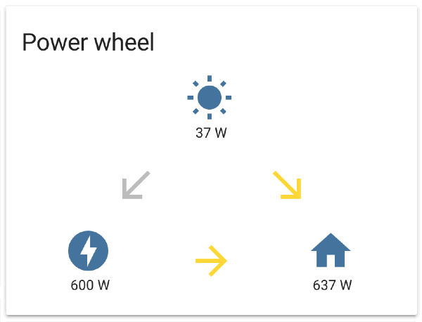
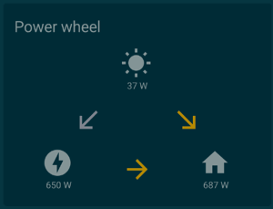

power-wheel-card
====

An intuïtive way to represent the power that your home is consuming or producing.
> Direct link to [GitHub](https://github.com/gurbyz/custom-cards-lovelace/tree/master/power-wheel-card).

## Features
Features of the custom power-wheel-card:
* Calculates the current power that your home is consuming: home power.
  Input for the calculation is the (produced) solar power and the (consumed or produced) grid power.
* Displays the three power values (solar, grid and home) in 'a wheel'.
* Displays the transition between these powers as arrows.
  E.g. if your solar power panels produce power, the arrow from solar to home turns active.
  And if your solar power panels produce enough power to deliver some back to the grid, the arrow from solar to grid turns active.
* Works for default theme and custom themes that use [standard CSS vars](https://github.com/home-assistant/home-assistant-polymer/blob/master/src/resources/ha-style.js).




## Requirements
1. You need to have a working sensor for your solar power. Write down the entity id of this sensor. This is *YOUR_SOLAR_POWER_SENSOR* in the instructions below.
    - This sensor has a `unit_of_measurement` set up, e.g. `'W'` or `'kW'`.
    - The sensor value should be of type *int* or *float*.
    - The sensor value should be positive.
    - The sensor could have an icon (optional) that will override the icon in the power-wheel-card.
1. You need to have a working sensor for your grid power. Write down the entity id of this sensor. This is *YOUR_GRID_POWER_SENSOR* in the instructions below.
    - This sensor has the `unit_of_measurement` set up as the sensor for solar power.
    - The sensor value should be of type *int* or *float*.
    - The sensor value should be **negative** for **producing** power to the grid and **positive** for **consuming** power of the grid.
    - The sensor could have an icon (optional) that will override the icon in the power-wheel-card.

### Example requirements configuration
This is not the configuration of the power-wheel-card itself, but an example configuration that's needed to have input sensors for the power-wheel-card.
An example configuration in `configuration.yaml` to comply to the requirements:

```yaml
sensor:
  - platform: template
    sensors:
      solar_power:
        friendly_name: 'Solar power production'
        unit_of_measurement: 'W'
        value_template: '{{ states.sensor.youless.attributes.pwr }}'
      grid_power:
        friendly_name: 'Grid power consumption'
        unit_of_measurement: 'W'
        value_template: '{{ (1000 * (states.sensor.power_consumption.state | float - states.sensor.power_production.state | float)) | int }}'
```

In this example the sensors names for *YOUR_SOLAR_POWER_SENSOR* and *YOUR_GRID_POWER_SENSOR* are `solar_power` resp. `grid_power`.

Not visible in the example above, but of course you have to have installed the hardware and configured it to feed your sensors.
In the example above I used a [rest sensor](https://www.home-assistant.io/components/sensor.rest/) for my [Youless](http://youless.nl/winkel/product/ls120.html) for the solar power.
For the grid power I used a [dsmr sensor](https://www.home-assistant.io/components/sensor.dsmr/) for my Iskra Smart Meter.
Because the dsmr sensor supplies 2 separate sensors for grid power consumption and grid power production, I had to combine them into one grid power sensor.
And because my solar power sensor and dsmr sensor don't report in the same unit of measurement, I had to convert that as well.

## Instructions
1. Check the requirements above. If you don't comply to the requirements, the card won't be much of use for you or just won't work.
1. Download the file [power-wheel-card.js](https://raw.githubusercontent.com/gurbyz/custom-cards-lovelace/master/power-wheel-card/power-wheel-card.js).
1. Save the file in the `www` folder inside your Home Assistant config folder.
1. Include the card code in your `ui-lovelace.yaml` file:

```yaml
resources:
  - url: /local/power-wheel-card.js?v=1
    type: module
```

> Note: You can increase the number in `v=1` whenever updating code to avoid having to manually clear the cache of your browsers and mobile apps.

5. Include a configuration for the power-wheel-card in your `ui-lovelace.yaml` file:

```yaml
views:
  - id: example_view
    cards:
      - type: "custom:power-wheel-card"
        solar_power_entity: sensor.YOUR_SOLAR_POWER_SENSOR
        grid_power_entity: sensor.YOUR_GRID_POWER_SENSOR
```

## Options

| Option | Type | Mandatory? | Default | Description |
|--------|------|------------|---------|-------------|
|type|string|**required**||Type of the card. Use `"custom:power-wheel-card"`.|
|solar_power_entity|string|**required**||Entity id of your solar power sensor. E.g. `sensor.YOUR_SOLAR_POWER_SENSOR`. See requirements above.|
|grid_power_entity|string|**required**||Entity id of your grid power sensor. E.g. `sensor.YOUR_GRID_POWER_SENSOR`. See requirements above.|
|title|string|optional|`"Power wheel"`|Title of the card.|
|home_power_icon|string|optional|`"mdi:home"`|Icon for home power.|

### More icons
The icons for solar power and grid power are taken from your own sensors for solar power and grid power.
If you haven't set up icons for them default icons will be used. For solar power: `mdi:weather-sunny`; and for grid power: `mdi:flash-circle`.

An example for overriding the other two icons, to be put in `configuration.yaml`:

```yaml
homeassistant:
  [...]
  customize:
    sensor.solar_power:
      icon: mdi:white-balance-sunny
    sensor.grid_power:
      icon: mdi:flash
```

## Advanced configuration example
A more advanced example for in the `ui-lovelace.yaml` file:
```yaml
- type: "custom:power-wheel-card"
  title: "Power distribution"
  solar_power_entity: sensor.YOUR_SOLAR_POWER_SENSOR
  grid_power_entity: sensor.YOUR_GRID_POWER_SENSOR
  home_power_icon: "mdi:home-assistant"
```

## License
This custom card is licensed under the [Apache License 2.0](https://github.com/gurbyz/custom-cards-lovelace/blob/master/LICENSE).

## Credits
* [gurbyz](https://github.com/gurbyz)