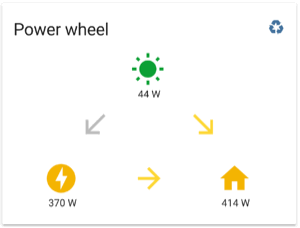
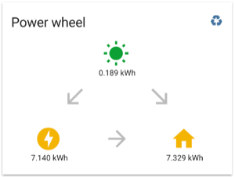

power-wheel-card
====

An intuïtive way to represent the power and energy that your home is consuming or producing.
> This component is discussed [here](https://community.home-assistant.io/t/lovelace-power-wheel-card/82374) on the Home Assistant forum.

## Features
Features of the custom power-wheel-card:
* Displays the three values (solar, grid and home) in 'a wheel'.
* Has different views for showing power values and showing energy values: the *power view* and the *energy view*. The initial view can be set. There is a toggle button to switch between views.
* Optionally calculates the current power that your home is consuming: home power.
  Input for the calculation is the (produced) solar power and the (consumed or produced) grid power.
* Optionally calculates the energy that your home is consuming: home energy.
  Input for the calculation is the (produced) solar energy and the (consumed or produced) grid energy.
* Displays the transition between these powers as arrows. (In *power view* only.)
  E.g. if your solar power panels produce power, the arrow from solar to home turns active.
  And if your solar power panels produce enough power to deliver some back to the grid, the arrow from solar to grid turns active.
* Optionally uses icons of your own choice, which can be set by card parameters or taken from your `customize:` sensor settings.
* Optionally colors the consuming icons yellow and the producing icons green. You can choose your own colors for consuming and producing.
* Works for default theme and custom themes that use [standard CSS vars](https://github.com/home-assistant/home-assistant-polymer/blob/master/src/resources/ha-style.js).
* Has support for [custom_updater](https://github.com/custom-components/custom_updater) custom component to check for new release via the custom tracker-card.




## Requirements for the *power view*
1. You need to have a working sensor for your solar power. Write down the entity id of this sensor. This is *YOUR_SOLAR_POWER_SENSOR* in the instructions below.
    - This sensor has a `unit_of_measurement` set up, e.g. `'W'` or `'kW'`.
    - The sensor value should be of type *int* or *float*.
    - The sensor value should be positive.
    - The sensor could have an icon (optional) that will override the default icon in the power-wheel-card if the card parameter `solar_icon` is not used.
1. You need to have a working sensor for your grid power. Write down the entity id of this sensor. This is *YOUR_GRID_POWER_SENSOR* in the instructions below.
    - This sensor has **the same** `unit_of_measurement` set up as the sensor for solar power.
    - Preferably this sensor has the same update interval as the sensor for solar power. (If not, the calculated value for home power can give unreal results sometimes.)
    - The sensor value should be of type *int* or *float*.
    - The sensor value should be **negative** for **producing** power to the grid and **positive** for **consuming** power of the grid.
    - The sensor could have an icon (optional) that will override the default icon in the power-wheel-card if the card parameter `grid_icon` is not used.

Nb. You don't need a sensor for your home power, but you can use if you have it available. The value will be calculated if your don't supply this sensor as card parameter.

### Example requirements configuration
This is not the configuration of the power-wheel-card itself, but an example configuration that's needed to have input sensors for the power-wheel-card.
An example configuration in `configuration.yaml` to comply to the requirements:

```yaml
sensor:
  - platform: template
    sensors:
      solar_power:
        friendly_name: 'Solar power production'
        unit_of_measurement: 'W'
        value_template: >-
          {{ state_attr("sensor.youless", "pwr") }}
      grid_power:
        friendly_name: 'Grid power consumption'
        unit_of_measurement: 'W'
        value_template: >-
          {{ (1000 * (states("sensor.power_consumption") | float -
                      states("sensor.power_production") | float)) | int }}
```

In this example the sensors names for *YOUR_SOLAR_POWER_SENSOR* and *YOUR_GRID_POWER_SENSOR* are `solar_power` resp. `grid_power`.

Not visible in the example above, but of course you have to have installed the hardware and configured it to feed your sensors.
In the example above I used a [rest sensor](https://www.home-assistant.io/components/sensor.rest/) for my [Youless](http://youless.nl/winkel/product/ls120.html) for the solar power.
For the grid power I used a [dsmr sensor](https://www.home-assistant.io/components/sensor.dsmr/) for my Iskra Smart Meter.
Because the dsmr sensor supplies 2 separate sensors for grid power consumption and grid power production, I had to combine them into one grid power sensor.
And because my solar power sensor and dsmr sensor don't report in the same unit of measurement, I had to convert that as well.

> **Tip.** If you are creating extra sensors for the power-wheel-card, maybe you want to exclude them in your `recorder:` setting.
Extra sensors based on your heavily updating DSMR sensors will let your database grow fast. 

## Requirements for the *energy view*
The *energy view* itself is not required. As a result you don't have to specify any *energy view* related card parameters. 
The toggle button for switching views won't be displayed.

> **Tip.** You can skip this paragraph and [start](#instructions) with a more simple setup first. 

But if you want the *energy view*:
1. Decide what kind of energy sensors you want to use. You could use your *smart meter counters* directly, but using self made sensors for e.g. *energy consumed or produced since last midnight* could provide more meaningful information on your power-wheel-card.
Especially since a future release will be able to convert the values into costs and savings. Then you would be able to see the actual energy costs/savings today. 
1. You need to have a working sensor for your solar energy. Write down the entity id of this sensor. This is *YOUR_SOLAR_ENERGY_SENSOR* in the instructions below.
    - This sensor has a `unit_of_measurement` set up, e.g. `'Wh'` or `'kWh'`.
    - The sensor value should be of type *int* or *float*.
    - The sensor value should be positive.
    - The sensor could have an icon (optional) that will override the default icon in the power-wheel-card if the card parameter `solar_icon` is not used.
1. You need to have a working sensor for your grid energy. Write down the entity id of this sensor. This is *YOUR_GRID_ENERGY_SENSOR* in the instructions below.
    - This sensor has **the same** `unit_of_measurement` set up as the sensor for solar energy.
    - Preferably this sensor has the same update interval as the sensor for solar energy. (If not, the calculated value for home energy can give unreal results sometimes.)
    - The sensor value should be of type *int* or *float*.
    - The sensor value should be **negative** for **producing** energy to the grid and **positive** for **consuming** energy of the grid.
    - The sensor could have an icon (optional) that will override the default con in the power-wheel-card if the card parameter `grid_icon` is not used.

Nb. You don't need a sensor for your home energy, but you can use if you have it available. The value will be calculated if your don't supply this sensor as card parameter.

## Instructions
1. Check the requirements above. If you don't comply to the requirements, the card won't be much of use for you or just won't work.
1. Download the file [power-wheel-card.js](https://raw.githubusercontent.com/gurbyz/custom-cards-lovelace/master/power-wheel-card/power-wheel-card.js).
1. Save the file in the `www` folder inside your Home Assistant config folder.
1. Include the card code in your `ui-lovelace.yaml` file:

```yaml
resources:
  - url: /local/power-wheel-card.js?v=1
    type: module
```

> **Note.** The actual number in `v=A_NUMBER` isn't relevant. You can increase the number whenever updating the source code to avoid having to manually clear the cache of your browsers and mobile apps.

5. Include a configuration for the power-wheel-card in your `ui-lovelace.yaml` file:

```yaml
views:
  - id: example_view
    cards:
      - type: "custom:power-wheel-card"
        solar_power_entity: sensor.YOUR_SOLAR_POWER_SENSOR
        grid_power_entity: sensor.YOUR_GRID_POWER_SENSOR
        color_icons: true
```

There are many more card parameters available, but it's advised to start with this simple setup to get things running. 

## Card parameters

| Parameter | Type | Mandatory? | Default | Description |
|--------|------|------------|---------|-------------|
|type|string|**required**||Type of the card. Use `"custom:power-wheel-card"`.|
|title|string|optional|`"Power wheel"`|Title of the card.|
|solar_power_entity|string|**required**||Entity id of your solar power sensor. E.g. `sensor.YOUR_SOLAR_POWER_SENSOR`. See requirements above.|
|grid_power_entity|string|**required**||Entity id of your grid power sensor. E.g. `sensor.YOUR_GRID_POWER_SENSOR`. See requirements above.|
|home_power_entity|string|optional|Default the home power value will be calculated.|Entity id of your home power sensor.|
|solar_energy_entity|string|optional|Default the *energy view* will not be enabled.|Entity id of your solar energy sensor. E.g. `sensor.YOUR_SOLAR_ENERGY_SENSOR`. See requirements above.|
|grid_energy_entity|string|optional|Default the *energy view* will not be enabled.|Entity id of your grid energy sensor. E.g. `sensor.YOUR_GRID_ENERGY_SENSOR`. See requirements above.|
|home_energy_entity|string|optional|Default the *energy view* will not be enabled. If `solar_energy_entity` and `grid_energy_entity` are set, then default the home energy value will be calculated.|Entity id of your home energy sensor.|
|solar_icon|string|optional|The icon of your own customized solar sensor(s). If not available, then `"mdi:weather-sunny"` will be used.|Icon for solar power and energy.|
|grid_icon|string|optional|The icon of your own customized grid sensor(s). If not available, then `"mdi:flash-circle"` will be used.|Icon for grid power and energy.|
|home_icon|string|optional|The icon of your own customized home sensor(s) if its entity parameter is set. If not available, then `"mdi:home"` will be used.|Icon for home power and energy.|
|power_decimals|integer|optional|`0`|Number of decimals for the power values.|
|energy_decimals|integer|optional|`3`|Number of decimals for the energy values.|
|color_icons|boolean|optional|`false`|To color the consuming icons green and the producing icons yellow. This setting only is affecting the three big icons for *solar*, *home* and *grid*. The arrows have colors by default.|
|consuming_color|string|optional|The yellow color for `--label-badge-yellow` from your theme. If not available, then `"#f4b400"` will be used.|CSS color code for consuming power icons if `color_icons` is set to `true`. Examples: `"orange"`, `"#ffcc66"` or `"rgb(200,100,50)"`. Don't forget the quotation marks when using the `#` color notation.|
|producing_color|string|optional|The green color for `--label-badge-green` from your theme. If not available, then `"#0da035"` will be used.|CSS color code for producing power icons if `color_icons` is set to `true`.|
|initial_view|string|optional|`"power"`|The initial view that will displayed. Allowed values are `"power"` for *power view* and `"energy"` for *energy view*.|

### More about icons
The icons for solar and grid can be set by card parameters as shown in the table above.
If you don't specify them as card parameters, the icons are taken from your own sensors for solar power and grid power (in the *power view*) and from your own sensors for solar energy and grid energy (in the *energy view*).
You could have specified those with the `customize:` option for `homeassistant` in your `configuration.yaml`.

If you haven't set up any icons for them, default icons will be used in all views. For solar: `mdi:weather-sunny`; and for grid: `mdi:flash-circle`.

An example for reusing the icons of your sensors used in the *power view*, to be put in `configuration.yaml`:

```yaml
homeassistant:
  customize:
    sensor.YOUR_SOLAR_POWER_SENSOR:
      icon: mdi:white-balance-sunny
    sensor.YOUR_GRID_POWER_SENSOR:
      icon: mdi:flash
```

## Advanced configuration example
A more advanced example for in the `ui-lovelace.yaml` file:
```yaml
- type: "custom:power-wheel-card"
  title: "Power distribution"
  solar_power_entity: sensor.YOUR_SOLAR_POWER_SENSOR
  grid_power_entity: sensor.YOUR_GRID_POWER_SENSOR
  solar_energy_entity: sensor.YOUR_SOLAR_ENERGY_SENSOR
  grid_energy_entity: sensor.YOUR_GRID_ENERGY_SENSOR
  solar_icon: "mdi:white-balance-sunny"
  grid_icon: "mdi:flash"
  home_icon: "mdi:home-assistant"
  power_decimals: 2
  energy_decimals: 2
  color_icons: true
  consuming_color: "#33ff33"
  producing_color: "#dd5500"
  initial_view: "energy"
```

## License
This custom card is licensed under the [Apache License 2.0](https://github.com/gurbyz/custom-cards-lovelace/blob/master/LICENSE).

## Credits
* [gurbyz](https://github.com/gurbyz)